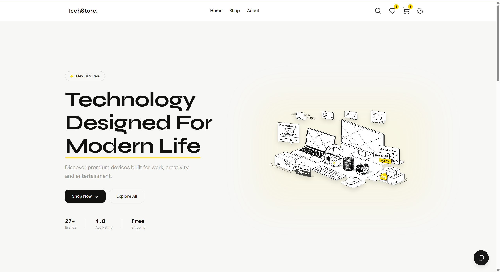

# TechStore

TechStore is a lightweight, responsive e-commerce frontend built with Vite, React, and Tailwind CSS. It showcases product listings, categories, product details, cart and wishlist flows, and client-side search and filters using a small local dataset.

This repository is ideal as a demo storefront, starter template for e-commerce UI, or learning project for modern frontend tooling.

## Features

- Responsive, mobile-first UI with Tailwind CSS
- Smooth animated transitions and interactions using Framer Motion
- Product listing, categories, and product detail pages
- Cart and wishlist UI (client-side state)
- Search and sort functionality, with debounced input
- Accessibility-minded components and keyboard-friendly interactions
- Local JSON data for products, categories, and reviews (no backend required)

## Tech stack

- React (JSX) + Vite
- Tailwind CSS + PostCSS
- Framer Motion for animations and interactive transitions
- Local data: JSON files in `src/data`
- Development tooling: ESLint, Vite dev server

## Quick start

1. Install dependencies

```bash
npm install
```

2. Start the dev server

```bash
npm run dev
```

3. Build for production

```bash
npm run build
```

4. Preview production build locally

```bash
npm run preview
```

## Available scripts

- `npm run dev` - Start Vite dev server
- `npm run build` - Produce a production build in `dist/`
- `npm run preview` - Preview the production build locally
- (project may include lint/test scripts depending on branch)

## Project structure (overview)

- `index.html` - App entry
- `src/main.jsx` - React entry point
- `src/App.jsx` - Root app component
- `src/pages/` - Route pages (Home, Shop, Product, Cart, Wishlist)
- `src/components/` - Reusable components and UI sections
- `src/data/` - Local JSON: `products.json`, `categories.json`, `reviews.json`
- `src/services/` - Lightweight data + API helpers
- `public/` - Static assets (images)
- `vite.config.js` - Vite configuration
- `tailwind.config.cjs` & `postcss.config.cjs` - Tailwind/PostCSS setup

Refer to the source files for more detail and to adapt the structure for your needs.

## Data and assets

Products, categories, and reviews are stored under `src/data` as JSON files and used by client-side services for the demo UI. Replace or extend these files to test with different products or categories. Product images are in the `public/images` folder.

## Contributing

Contributions and improvements are welcome. Suggested workflow:

1. Fork the repository and create a branch for your change
2. Make changes and test locally with `npm run dev`
3. Open a pull request with a clear summary of changes

If you add new dependencies, update `package.json` and include rationale in your PR.

## Notes & Next steps

- This project is a frontend demonstration and doesn't include server-side persistence by default. To add a backend, wire the UI to your API in `src/services/productsApi.js` and update integration points in the components and features folders.
- To add tests, consider introducing Jest + React Testing Library and add scripts to `package.json`.

## License

This project is provided as-is. Add a license file (e.g., MIT) if you plan to publish or open-source the repository.

---

## Demo



